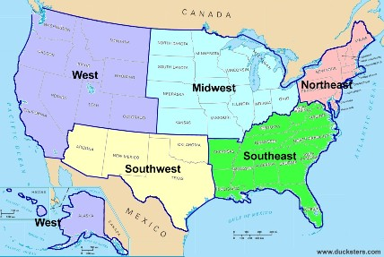
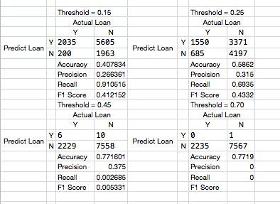

Predicting Automotive Leads

Objectives

1) Using retail loan lead data develop a model predicting borrower behavior.

2) Develop a scoring product an end user can work with.

Background

Automobile finance is highly competitive.  Savvy consumers can price loans online easily filtering competitive rates into acceptable or unacceptable categories.  Lenders rank bought online leads (in addition to those generated in house) in order to contact the best potential clients. Accurate algorithms are critical to contacting the right customer.

Data for this project originated from a mid-size automobile finance company.  The company acts as a middle man, a broker, steering leads to financial institutions.

The Set Up Problem

Data provided for this project is not identified by name or purpose.  All column headings are titled Variable1, Variable2, ..., Result01. An educated guess easily distinguishes a few fields.  Variable 6 is clearly a state column, Variable 3 is categorical, Variable 5 is credit score, Variable11 is probably loan amount and Variable07 may be primary borrower age.

Feature Engineering

Data is sparse for variables 2, 7-11.  Variable 5 is missing a few rows.

 

 K nearest neighbor(5) was chosen to fill in blank numeric fields.  Because of RAM limitations the data was split into three separate dataframes comprising approximately 10,000 before running KNN.

 Below is the variance inflation factor for the y intercept and the 14 feature variables.  Two variables were cut after trial one due to VIF's in excess of 5.

 

 States were divided into region six regions each of which was assigned to a dummy classification.

 

High Level Statistics for Cleaned Data

 

Below is an example of the distribution of loan amount to approvals.

This correlation matrix shows no one particular input is highly correlated with Result02.

Model

Result02 = Variable01  +  Variable03 + Variable05 +  Variable07 +  Variable08 +  Variable09 +  Variable10 +  Variable11 +  Region_MW +  Region_NE +  Region_P +  Region_S +  Region_WE

Below is a fabricated cost benefit matrix used to price successful matches and punish false positives.  An assumption is the firm can only contact so may potential borrowers per day.  Predicted rejects are potential borrowers scoring too low to contact.  Predicted acceptance are potential borrowers the firm believes have a reasonable chance for acceptance.

Results

When all variables (except Region_MT) are included the profit matrix and ROC curve are displayed below.

Below is the same model as above less regions.

Below is a model with even fewer features.

Confusion Matrix (All inputs p = [0.15, 0.25, 0.45. 0.70])

This confusion matrix tells the whole story.  At low confidence the company calls many leads, accepting a false positive to true positive ratio of 2:1.  This leads to a lot of time (calling customers, preparing documentation, following up) wasted on customers who will never ultimately agree to a loan.  It also leads to your most profitable business.

Conclusion

All models outperform random guesses.  The firm lands 22.5% of all loan applications.  At a 15% confidence interval this model accurately predicts 26.5% of all applicants and at the 25% threshold it accurately predicts 31.5% of all applicants.

Utilizing the model will allow the institution to categorize incoming leads to into more likely and less likely to perform categories.  A right to left utilization of the model (picking the most likely to succeed) will lead to better business results.

Lessons Learned

* The model was probably underfit due to performance decreases when variables were removed.
* Be a better programmer
* Experience with data sets and regression modeling prior would help.
* Predicting negatives is important too
* Include fixed business costs

Future Work

* The same data set would be interesting with time components built in (i.e how long loans last in the pipeline before terminating)

References:

Galvanize Data Solutions Folder

https://www.ducksters.com 2018-10-11, US Geography Regions
