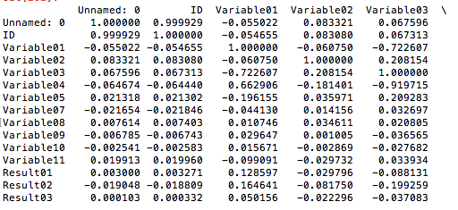
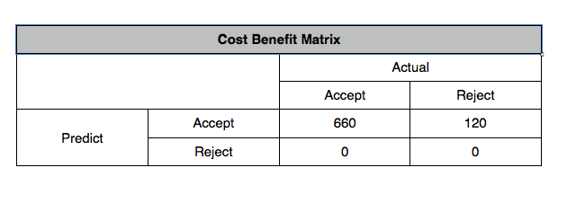
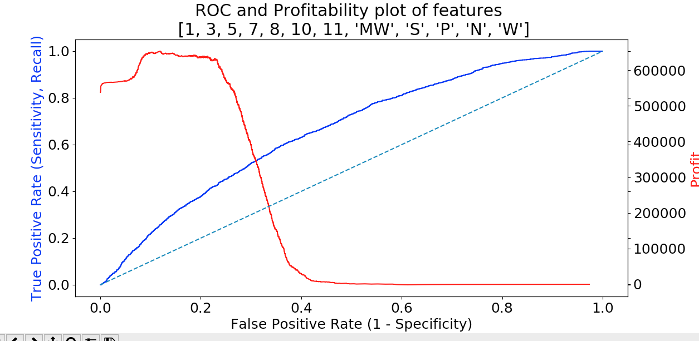

Background
Automobile finance is highly competitive.  Savvy consumers can price loans online easily filtering competitive rates into acceptable or unacceptable categories.  Lenders rank bought online leads (in addition to those generated in house) in order to contact the best potential clients. Accurate algorithms are critical to contacting the right customer.

Data for this project originated from a mid-size automobile finance company.  The company acts as a middle man, a broker, steering leads to financial institutions.

The Set Up Problem

Data provided for this project is not identified by name or purpose.  All column headings are titled Variable1, Variable2, ..., Result01. An educated guess easily distinguishes a few fields.  Variable 6 is clearly a state column, Variable 3 is categorical, Variable 5 is credit score, Variable11 is probably loan amount and Variable07 may be primary borrower age.

Data is sparse for variables 2, 7-11.  Variable 5 is missing a few rows.

 

High Level Statistics for Cleaned Data

 

K nearest neighbor(5) was chosen to fill in blank numeric fields.  Because of RAM limitations the data was split into three separate dataframes comprising approximately 10,000 before running KNN.

States were broken divided into region six regions each of which was assigned to a dummy classification.

Below is an example of the distribution of loan amount to approvals.

Below is the variance inflation factor for the y intercept and the 14 feature variables.  Two variables were cut after trial one due to VIF's in excess of 5.

The Problem

Can I predict loan originations given input data? A logistic model was developed to predict true/false.  

When all variables (except Region_MT) are included the profit matrix and ROC curve are displayed below.

Conclusion

This model outperforms random guesses.  Utilizing the model will allow the institution to categorize incoming leads to into more likely and less likely to perform categories.  A right to left utilization of the model (picking the most likely to succeed) will lead to better business results.

Lessons Learned

* Be a better programmer
* Experience with data sets and regression modeling prior would help.
* Predicting negatives is important too
